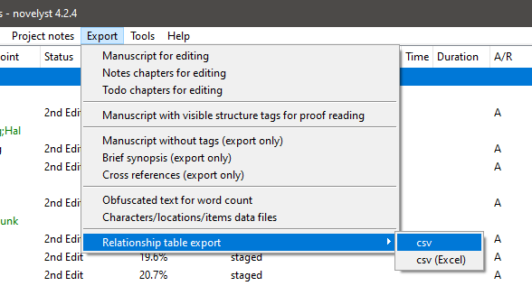
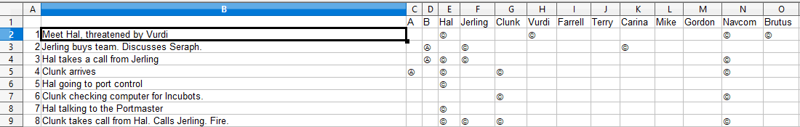

# novelyst_retablex

The [novelyst](https://peter88213.github.io/novelyst/) Python program helps authors organize novels.  

*novelyst_retablex* is a plugin providing a csv relationship table export.

## Features

- The plugin adds a "Relationship table" submenu to the *novelyst* "Export" menu.
- Export as "standard" csv, or a csv formatted for Excel.
- The exported document is placed in the project folder.

## Requirements

- [novelyst](https://peter88213.github.io/novelyst/) version 4.0+

## Download and install

[Download the latest release (version 1.1.0)](https://github.com/peter88213/novelyst_retablex/raw/main/dist/novelyst_retablex_v1.1.0.zip)

- Extract the "novelyst_retablex_v1.1.0" folder from the downloaded zipfile "novelyst_retablex_v1.1.0.zip".
- Move into this new folder and launch **setup.pyw**. This installs the plugin for the local user.

---

[Changelog](changelog)

## Usage

See the [instructions for use](usage)

## License

This is Open Source software, and the *novelyst_retablex* plugin is licensed under GPLv3. See the
[GNU General Public License website](https://www.gnu.org/licenses/gpl-3.0.en.html) for more
details, or consult the [LICENSE](https://github.com/peter88213/novelyst_retablex/blob/main/LICENSE) file.
